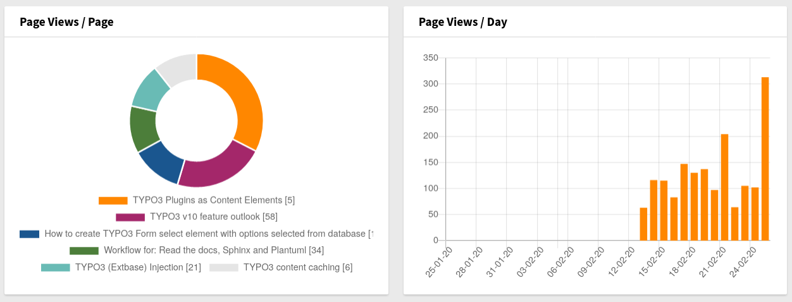
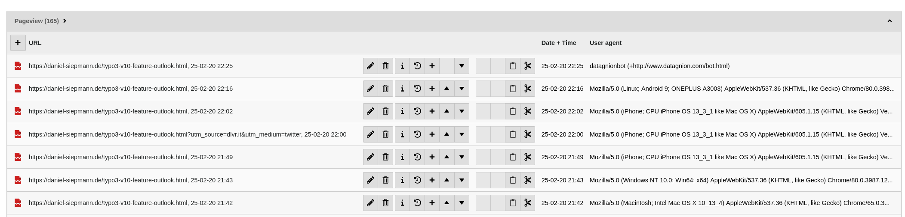
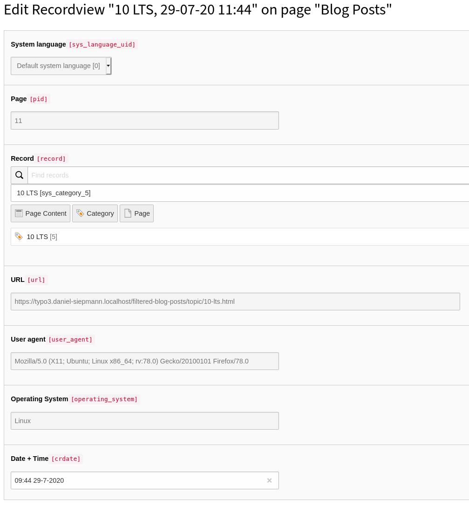

About
=====

This extension was made to demonstrate technical features of TYPO3.
Since v1.0.0 it is also available on packagist and intended for usage on production
systems.

The following features should be demonstrated:

PSR-4 Autoloading Standard
   Use `composer.json` to provide autoloading information.
   Classes will be loaded when needed. No need for require statements.

PSR-12 Extended Coding Style Guide
   Current stable Coding Style Guide, applied via Coding Sniffer.

PSR-7 HTTP Message Interface
   Also known as Request Response, used to create tracking information from incoming
   request.

PSR-11 Container Interface
   Also known as Dependency Injection.
   Used to resolve external dependencies, e.g. foreign classes.
   Existing TYPO3 factories are used to build `QueryBuilder` instances.
   Also DI is "misused" to provide configuration for dashboard widgets
   and tracking.

PSR-15 HTTP Handlers
   Also known as middlewares.
   Used to hook into processing to create tracking information.

PSR-14 Event Dispatcher
   Not in use yet.

EXT:dashboard
   Used to visualize collected tracking information.

Todos
=====

#. Add version matrix to test with multiple PHP versions.

Thanks
======

Thanks to our supporters:

Icons
   Generated by https://www.werkraum-media.de/

Partly sponsored code by
   https://www.werkraum-media.de/

Example
=======

The following widgets are added and could look like:

A new record is added which looks like:

