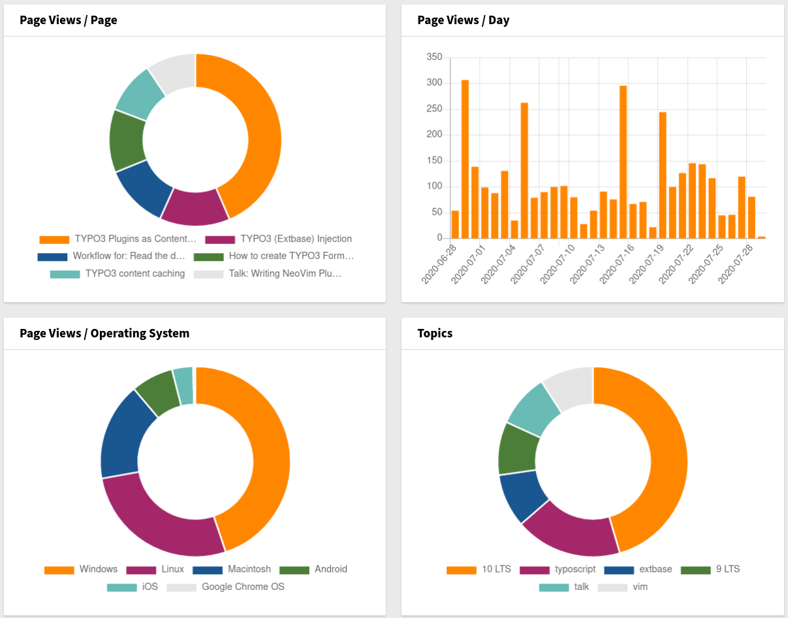

About
=====

This extension should only demonstrate technical features of TYPO3.
It is not intended for use in production systems.

The following features should be demonstrated:

PSR-4 Autoloading Standard
   Use `composer.json` to provide autoloading information.
   Classes will be loaded when needed. No need for require statements.

PSR-12 Extended Coding Style Guide
   Current stable Coding Style Guide, applied via Coding Sniffer.

PSR-7 HTTP Message Interface
   Also known as Request Response, used to create tracking information from incoming
   request.

PSR-11 Container Interface
   Also known as Dependency Injection.
   Used to resolve external dependencies, e.g. foreign classes.
   Existing TYPO3 factories are used to build `QueryBuilder` instances.
   Also DI is "misused" to provide configuration for dashboard widgets
   and tracking blacklists.

PSR-15 HTTP Handlers
   Also known as middlewares.
   Used to hook into processing to create tracking information.

PSR-14 Event Dispatcher
   Not in use yet.

EXT:dashboard
   Used to visualize collected tracking information.

Todos
=====

#. Add 100% code coverage (Widgets are missing)

#. Add campaigns if possible (twitter parameter, etc.)

#. Add referrer if available.

#. Add operating System

   #. Another Symfony Expression which returns the OS ("Ubuntu", "Macintosh", "Android", "iPhone", "Windows")

#. Add further widgets.

   #. Grouped by user agents (bar).

   #. Top 404 requests (Collect them to show them, doughnut).

#. Move bot detection to another rule.

   #. Keep indexing those requests, but mark them as bot and separate them in widgets.

   #. Provide an overview of crawls as widgets. E.g. to allow fine grained robots.txt.

#. Add information to Admin Panel.
#. Add command that will iterate over all DB entries and remove ones matching the black list rule.
   E.g. if rule is adjusted in meanwhile.

Example
=======

The following widgets are added and could look like:

A new record is added which looks like:

